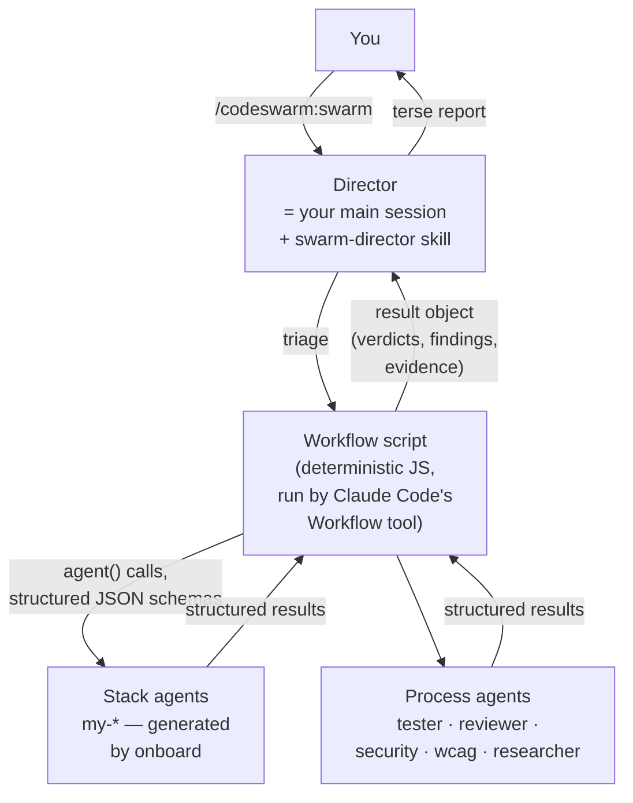

# Architecture

How the pieces fit, and why they are shaped this way.

## The model

- **Director** — your main Claude Code session with the
  `codeswarm:swarm-director` skill loaded. It triages the task, reads the
  config, builds workflow arguments, launches ONE workflow script, reads the
  structured result and reports. It never implements or reviews inline.
- **Workflow scripts** (`workflows/*.js`) — deterministic orchestration:
  fixed phases, explicit fan-out, JSON-schema-forced agent outputs. The
  control flow lives in code, not in model improvisation; the same task
  shape always produces the same orchestration shape.
- **Agents** — two kinds. *Process agents* ship with the plugin (tester,
  reviewer, security auditor, WCAG auditor, researcher) and are
  stack-agnostic: they read the target repo's own `CLAUDE.md`/`AGENTS.md`
  and project skills. *Stack agents* (`my-*`) are generated into your clone
  by `/codeswarm:swarm onboard` and carry your stack's conventions.
- **Skills** — the director's manual plus setup/doctor/repo-entry; generated
  `my-*` convention skills carry your repo rules.
- **Hooks** — two tiny Node scripts (see
  [security.md](security.md)): a SessionStart nudge and a prompt router that
  loads the director when you mention the swarm.
- **Standalone runner** (`runner/`) — a fallback execution vehicle that runs
  the same workflow scripts unchanged OUTSIDE the Workflow tool: its own
  harness (same contract clauses, tested), one `claude -p` subprocess per
  agent, JSONL journal with resume, agent definitions read from
  `agents/*.md` at spawn time. Exists because the Workflow tool has no
  stable public API: when an update breaks it, the swarm degrades (no
  progress UI, permissions pre-granted per [security.md](security.md))
  instead of dying. `node runner/run.js <workflow> --args '<json>'`;
  resume with `--resume <runId>`.

## Quality patterns (the WHY)

- **Independent verification, always.** An implementer's claim is never the
  verdict: a separate tester re-runs the suite; review findings pass
  independent existence checks plus a severity gate before you see them.
  Agents that check work never wrote that work.
- **Adversarial review.** Reviewers hunt problems with severity tags; a fix
  round is followed by re-test and re-review, not by trust.
- **Finder fusion.** Reviewer-flavored dimensions (bugs, performance,
  conventions, architecture) run as ONE finder pass so the repo is read once,
  not once per dimension; specialist dimensions (security, WCAG,
  test-coverage) stay separate agents.
- **Model + effort tiering.** Mechanical work runs on the cheapest tier,
  verification on a mid tier, implementation and final gates inherit your
  session model (or the configured `topModel` cap). Spend follows stakes.
- **Quiet by default.** Agent transcripts are write-only cost: every agent
  gets a silent-mode directive; results come back as structured JSON.
  Evidence rules (verbatim test output lines, file:line citations) still
  hold.
- **Determinism + resume.** Because orchestration is a script, a crashed or
  rate-limited run resumes from cache: completed agents replay free, only
  the missing tail runs live.

Token philosophy in one line: when it costs more, it did more *work*
(breadth or verification) — never wasted it. Parallelism is a *speed*
optimization, not a cost driver: the same agents cost the same tokens run
concurrently or one after another. What lowers the bill is fewer agents and
less re-reading — see [Cost](workflows.md) and the README cost section.

## Repository layout

| Path | What |
|---|---|
| `.claude-plugin/` | plugin + marketplace manifests |
| `commands/` | the `/codeswarm:swarm` entrypoint command |
| `skills/` | director + its on-demand sub-flows (greenfield, resume, issues), setup, doctor, repo-entry (+ generated `my-*`) |
| `agents/` | the five process agents (+ generated `my-*`) |
| `workflows/` | the seven workflow scripts |
| `hooks/` | two Node hook scripts, their config and pipe tests |
| `runner/` | standalone runner: harness + claude-driver + journal + CLI (Workflow-tool fallback) |
| `tools/` | `record-eval.js` — owns the eval-log append and the `lastSmokeVersion` config write (+ its test) |
| `templates/` | templates onboard uses to generate agents/skills |
| `fixtures/smoke/` | planted-bug fixture for `/codeswarm:swarm smoke` |
| `fixtures/eval/`, `eval2/`, `eval3/` | graded eval fixtures (planted bugs + false-positive trap files) for recall/precision and the A/B verify delta; `eval3` is precision-weighted |
